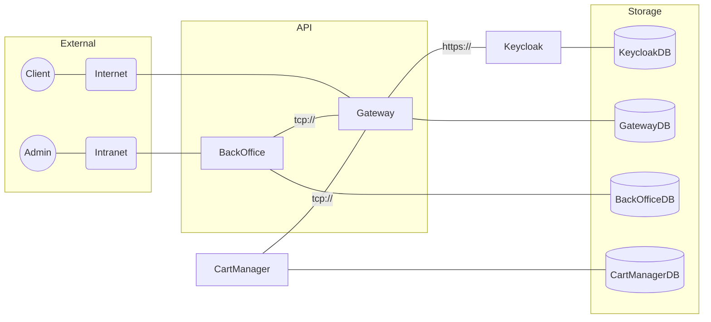

# Game Shop

## Architecture

```mermaid
graph LR
Gateway -- https:// --- Keycloak

Keycloak --- KeycloakDB[(KeycloakDB)]

CartManager -- tcp:// --- Gateway
BackOffice -- tcp:// --- Gateway

BackOffice --- BackOfficeDB[(BackOfficeDB)]
CartManager --- CartManagerDB[(CartManagerDB)]
Gateway --- GatewayDB[(GatewayDB)]

subgraph API
   Gateway
   BackOffice
end

subgraph External
    Client((Client)) --- Internet(Internet)
    Admin((Admin)) --- Intranet(Intranet)
end

subgraph Storage
   CartManagerDB[(CartManagerDB)]
   GatewayDB[(GatewayDB)]
   BackOfficeDB[(BackOfficeDB)]
   KeycloakDB[(KeycloakDB)]
end

Intranet(Intranet) --- BackOffice
Internet(Internet) --- Gateway
```